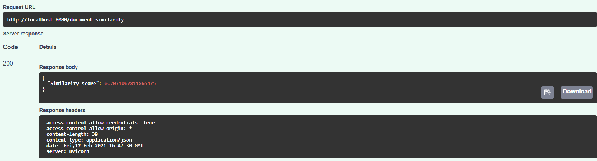

# DocumentSimilarity

## Prerequisites
1.Install docker from the below link:

https://docs.docker.com/engine/install/


## Source Repository
1.Download the existing repository to local computer using the below clone command:
```
git clone https://github.com/kavithasubramaniyan/document-similarity
```

2.Change the directory to document-similarity
```
cd document-similarity
```

## Steps to run docker
#Step1:command to create Docker Image
```
docker build -t kavithasubramaniyan/docs-sim-image:0.1 .
```

# Step2:command to get the image id of latest image created
```
docker images
```

# Step3:command to run docker
```
docker run -p 127.0.0.1:8090:8080 latest_image_id
```
##Server Response
#Response code 200-Successful
#Response code 422-Validation Error 

##Output 
#Document similarity score


##command line utility to make POST request
```
curl -X POST "http://localhost:8080/document-similarity" -H  "accept: application/json" -H  "Content-Type: application/json" -d "{\"document1\":\"input_string1\",\"document2\":\"input_string2\"}"
```


